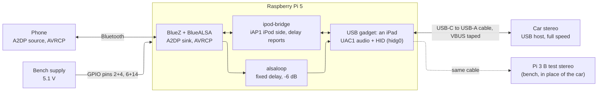
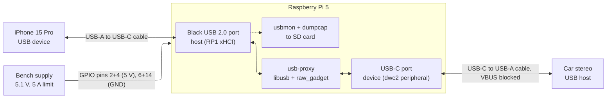

# pi-iap-bt-bridge: plan

Status (09/10/2026): the Pi 5 plays a phone's Bluetooth audio to the car stereo as an iPod, with track data and controls (Phases 8–11). Delay reporting is in progress (Phase 12). The project started on 08/10/2026 as a USB relay and sniffer (Phases 0–6); section 6 keeps that history. See [README.md](README.md) for how everything works.

## 1. Goal

A Raspberry Pi synthesizes iAP1 from a Bluetooth input. The car stereo knows only iPods: iAP1 over USB HID, audio over USB Audio Class 1, as a full-speed USB host. A phone connects to the Pi over Bluetooth (A2DP for the audio, AVRCP for the track data and the controls). The Pi is an iPod to the stereo: it answers like the iPad of session `car-10`, with the phone's data, and turns the stereo's buttons into AVRCP commands.

| Input | Value |
|---|---|
| Stereo | Suzuki PA68L0 = Panasonic CQ-JZ41F0AE, factory unit in a Suzuki Swift of about 2010. USB-A socket, full-speed USB host only, text display. Speaks iAP1 (old identification, no transaction IDs). |
| Phones | iPhone 15 Pro (iOS 27) and an iPad (iOS 26.6.1). The car runs used the iPad. |
| The Pi | Raspberry Pi 5 with onboard Bluetooth, USB-C port in gadget mode. The same Pi was the relay. |
| Bench stereo | Raspberry Pi 3 B (`tools/test-stereo`) |
| Authentication | No Apple key exists here. The stereo authenticates itself to the iPod; the Pi does not need to sign. |
| Power | Bench supply into the GPIO header, in the car |

## 2. Architecture



## 3. Status (09/10/2026)

| Part | State |
|---|---|
| USB gadget and iAP1 session | Works in the car and on the bench. |
| Track data and controls | Work in the car: play, pause (mute), next, back, DISP, RDM, RPT. |
| No phone | "Waiting" track; works in the car. |
| Audio | Plays in the car. Some clipping remains at -6 dB (R22). The new `alsaloop` player has not run with a USB host yet. |
| Pairing, reconnecting | Automatic (R20). |
| Delay reporting | The iPad accepts the report; the value is the 500 ms target until the bench measurement (R23). |
| Relay, decoder, test stereo | Kept as tools. The relay has one known bug (R17). |

## 4. Open work

1. **Measure the Pi's delay on the bench.** Connect the Pi 5 to the Pi 3 (taped cable), keep the iPad near, run `./latency-test.sh`. Put the measured rest of the pipeline into `pipelineExtra` (`bridge/main.go`) and deploy. Check `alsaloop` at the same time: sound, a pause of the phone, a phone that goes away.
2. **Car: check the new audio path and the lip sync.** Play a video on the iPad and compare the picture with the car's sound.
3. **Clipping:** try `IPOD_AUDIO_GAIN_DB=-9` or `-12` in the car (R22).
4. **The iPad's device type:** Settings, Bluetooth, Pi iPod, Device Type: Car Stereo. Pair again so that the iPad sees the new Bluetooth class (car audio).
5. **Skips:** jumps of several tracks with a phone, and "previous" between 2 s and 3 s into a track (R21).
6. **The stereo's own delay** is not measured (decision: Pi part only). `IPOD_EXTRA_DELAY_MS` can add it later.
7. **Wi-Fi next to Bluetooth** in the car: not checked.
8. Relay tools (low priority): see [tools/relay/README.md](tools/relay/README.md), section 8 (golden captures, `car-15`, the iPhone in the car, R17).

## 5. Decisions

The user's decisions, in order. Each one changed the design.

| Date | Decision |
|---|---|
| 08/10/2026 | Goal of the first project: capture and decode, no changes to the traffic. C/C++ relay (`usb-proxy`), Python decoder. Bench supply in the car. |
| 09/10/2026 | Test stereo: a Pi 3 B that emulates the stereo with iAP1, at full speed. A bare Pi OS card and deploys over SSH, not a baked image. |
| 09/10/2026 | Relay: ack `SET_CONFIGURATION 0` only (patch 09). |
| 09/10/2026 | Final piece: the Pi 5 as a Bluetooth audio sink and an iPod to the stereo, with all track data and the stereo's controls. The Pi 3 is the test stereo. |
| 09/10/2026 | Pairing without SSH: a pairing window 60 s after boot when no phone is connected; dead pairings are removed automatically. |
| 09/10/2026 | No phone: first, reply OK and do nothing. Then: a "Waiting" track (silence, all track texts "Waiting"); the iPod name stays "iPod"; the track follows the stereo's play state and starts a phone that connects. |
| 09/10/2026 | Skips: a track number of about 500 on the display is acceptable (virtual list of 1000). |
| 09/10/2026 | Audio level: fixed -6 dB, settable (`IPOD_AUDIO_GAIN_DB`), not the iPad's volume. |
| 09/10/2026 | Delay: measure the Pi's part only; hold the delay constant with `alsaloop`; keep the 500 ms buffer; report it to the phone (A2DP delay reporting). |
| 09/10/2026 | The iPad's volume slider: leave it as it is. Plain Bluetooth has no documented way to grey it out; a snap-back to full was declined. |
| 09/10/2026 | Repository: re-purposed to the bridge and renamed `pi-iap-bt-bridge`. The bridge is at the top level; the relay, the decoder and the test stereo are in `tools/`. |

## 6. History: how we got here

This section keeps the record of each step: what was planned, what happened, and what it taught. The first goal was a sniffer. Its captures made the bridge possible.

### The first goal: a USB relay and sniffer

Inputs, as given on 08/10/2026:

| Input | Value |
|---|---|
| Stereo | Suzuki PA68L0 = Panasonic CQ-JZ41F0AE, Suzuki part 39101-68L01. Factory unit in the Suzuki Swift, about 2010–2017. |
| Stereo connector | USB-A socket |
| iPhone 15 Pro on the stereo today | Works fully (music and controls) |
| iOS version | iOS 27 |
| Garage Wi-Fi reaches the car | Yes |
| Goal | Capture and decode. No changes to traffic. |
| Audio path | Digital, over USB |
| Power | Bench supply, used in the car, in your garage |
| Capture output | Files on storage. No live view. |
| Shutdown handling | Not needed yet |
| Languages | C/C++ relay, Python decoder |

Corrections to the original idea:

1. **The Pi's USB-C port must be a USB device, not a host.** The stereo is the USB host. To the stereo, the Pi must look like an iPhone. So the USB-C port runs in peripheral (gadget) mode. The Pi's USB-A port is the host side for the iPhone.
2. **The iAP data goes over USB HID, not a bulk "iAP interface".** In this setup the iPhone is the USB device. The iPhone's configuration 2 ("iPod USB Interface") gives:
   - USB Audio Class 1 (isochronous IN): this carries the music.
   - HID: this carries the iAP messages. The iPhone sends interrupt IN reports. The stereo sends output reports.
   The bulk interface (class 0xFF, subclass 0xF0) is only for CarPlay-style "USB host mode". Your stereo does not use that mode.
3. **The stereo very likely speaks iAP1 over HID.** The PA68L0 design dates from about 2010. iAP2 arrived in 2012. The iPhone works with the stereo on iOS 27, so iOS still answers iAP1 over USB. The decoder treats iAP1 as the main path and iAP2 as a secondary path. The first capture will confirm the protocol (tools/decode/README.md, section 3.1, layer L2). It did: iAP1.
4. **The stereo's USB host may be full speed only (12 Mbit/s).** Many car units from that time are. This can affect the relay. See risk R11.

### Relay topology



How it works:

1. The iPhone connects to the Pi's host port. The Pi reads its descriptors with libusb.
2. `usb-proxy` copies those descriptors to the USB-C gadget port through the `raw_gadget` kernel module.
3. The stereo sees an "iPhone" and talks to it. `usb-proxy` sends each request to the real iPhone and sends each response back.
4. `usbmon` records every transfer between the Pi and the iPhone. Because the relay copies everything, this one capture holds both directions.
5. The `usb-proxy` log records the gadget-side events. Examples are enumeration and `SET_CONFIGURATION`.

Each phase has an exit test. Do not start a phase until the previous exit test passes.

### Phase 0: preparation (no Pi connection needed)

1. Buy the parts in section 7.
2. Flash the SD card. For first setup at a desk, power the Pi from its normal USB-C supply. Update the EEPROM. Apply the settings in tools/relay/README.md, section 5.1. Build `raw_gadget` and `usb-proxy`.
3. On the Mac, write the decoder skeleton and its unit tests (tools/decode/README.md, section 3). Use synthetic frames. No hardware is needed.
4. Make the VBUS-blocked cable. Check it with the multimeter (section 8.2).

Exit: `ls /sys/class/udc` shows `1000480000.usb`. `raw_gadget` loads. `usb-proxy` builds. The decoder unit tests pass.

### Phase 1: Pi on GPIO power, at a desk

1. Remove the USB-C supply. Connect the bench supply to the GPIO header (section 8.1).
2. Boot. Check that `vcgencmd get_throttled` returns `0x0`.
3. Put the USB-C breakout on the Pi's USB-C port. Measure VBUS to GND.
   - About 5 V: VBUS connects to the 5 V rail. Without the block, the Pi would push current into the stereo. VBUS must stay blocked.
   - About 0 V: something blocks current from the rail out to VBUS. Current from the stereo into the rail is still possible. Keep VBUS blocked anyway.
4. Record the result in the session notes.

Exit: the Pi runs stable on GPIO power, and you know the VBUS state.

Result (08/10/2026): **0 V** on USB-C VBUS with GPIO power. Measured at the far USB-A plug of a USB-C to USB-A cable, against GPIO pin 6; the plug shell beeps to pin 6. So the Pi does not drive VBUS from its rail. Current from a host into the Pi's rail is still not known, so VBUS stays blocked. To confirm the reading, check that the cable charges an iPhone from a USB-A charger.

### Phase 2: iPhone on the host side only

1. Charge the iPhone to 100%.
2. Plug the iPhone into a **black** USB 2.0 port. This forces high speed (480 Mbit/s).
3. Save `lsusb -v -d 05ac:` and `lsusb -t` to a file. Note the PID, the bus number and all configurations.
4. Check that no host driver or service holds the iPhone's interfaces.
5. Run a short `usbmon` capture on that bus. Check that `dumpcap` writes a readable file.

Exit: the descriptors are saved. Configuration 2 shows the audio and HID interfaces. The capture opens in Wireshark.

Result (08/10/2026, passed): iPhone `05ac:12a8`, bcdDevice 16.01, bus 1, 480 Mbit/s. Linux selects configuration 1 (PTP). No host driver binds. Descriptors: `sessions/phase2-20261008-194356/`.

| Config | Name | Interfaces and endpoints |
|---|---|---|
| 1 | PTP | if0 imaging: bulk 0x02 OUT, bulk 0x81 IN, interrupt 0x83 IN |
| 2 | iPod USB Interface | if0 audio control; if1 audio streaming (alt1: isochronous 0x81 IN, 192 bytes, bInterval 4); if2 HID: interrupt 0x83 IN, 64 bytes, bInterval 1 |
| 3 | PTP + Apple Mobile Device | config 1 + if1 usbmux (0xFF/0xFE/0x02): bulk 0x04 OUT, 0x85 IN |
| 4 | PTP + Apple Mobile Device + Apple USB Ethernet | config 3 + if2 Ethernet (0xFF/0xFD/0x01): bulk 0x86 IN, 0x05 OUT |

Consequences:
- The HID interface has no interrupt OUT endpoint. So the stereo sends iAP data to the iPhone only as `SET_REPORT` control transfers (decoder L1).
- 192 bytes every 1 ms fits 48 kHz, 16-bit stereo audio as the maximum rate (decoder L5).
- The `bInterval` values (4 and 1) use high-speed units. They become wrong if the stereo runs at full speed (risk R11).
- Configuration 2 needs only two IN endpoints plus EP0. This is within the dwc2 limits.

### Phase 3: relay smoke test with the Mac as host

The Mac takes the place of the stereo. Use a USB-C to USB-A adapter on the Mac and the same VBUS-blocked cable. Do not use a USB-C to USB-C cable, because the Mac would then supply VBUS.

1. Start `usb-proxy`.
2. On the Mac, check that the "iPhone" shows in Finder and in Image Capture. The Mac uses the usbmux and PTP configurations. This tests bulk transfers and configuration changes. It does not test HID or audio.

Exit: Image Capture lists photos through the relay. If the gadget does not connect, see section 8.2, step 4.

Results (08/10/2026, 9 sessions). The gadget connected with VBUS taped (R2 resolved). Four separate problems appeared, and each needed a fix:

| Problem | Fix |
|---|---|
| macOS sends the Apple charge request (`0x40/0x40`, 2400 mA). The iPhone trips the Pi's 1.6 A USB-A limit (R4). | `rules/apple-vendor-rules.json` ignores it. The patch acks the ignored request to the host. |
| macOS sends "set USB mode 4" (`0xC0/0x52`). The iPhone re-enumerates with 6 configurations (adds NCM). | The same rule file stalls it. The patch checks ignore/stall rules **before** an IN request is forwarded; the original code forwarded first. |
| `usb-proxy` resets the iPhone at start. After a reset, Linux compares the descriptors and treats a change as a new device, so the relay looped. | `rules/config.json` sets `reset_device_before_proxy: false`. `PROXY_RESET=1` restores the reset. |
| When the iPhone re-enumerates, `usb-proxy` hangs and also sends SIGINT to its whole process group. | `capture _proxyloop` supervises it in its own session (`setsid`) and restarts it on a new device number. |
| After about 2 minutes idle the Mac suspends the bus. An endpoint write then returns `EAGAIN`, and `usb-proxy` calls `exit()`. A car stereo can suspend the bus too. | `usb-proxy-03-suspend-retry.patch`: on `EAGAIN` the write waits and retries, and the read polls again. |

The Mac also brought up "iPhone USB" (Personal Hotspot over USB) through the relay and got an address by DHCP, so the bulk data path carries real traffic.

**Phase 3 passed (08/10/2026, session 10):** Image Capture lists the iPhone through the relay. The relay survived a bus suspend and a host reset after wake. Finder did not show the iPhone, and the iPhone asked for Trust more than once, so `usbmux` pairing does not complete through the relay. The stereo does not use that path, so this is noted and not fixed. Sessions `phase3-mac-1` to `-10` stay on the Pi under `/root/sessions/`; they hold `usbmux` pairing data, so do not publish them.

With these fixes the iPhone stays connected and macOS enumerates the relay, sets configuration 6 and exchanges `usbmux` data. Configuration 6 needs all 14 dwc2 endpoints, so the Mac test also needs `PROXY_ARGS=--auto_remap_endpoints`. The stereo's configuration 2 needs two endpoints, so the car sessions run without remapping.

### Phase 4: car baseline, no Pi

1. Connect the iPhone straight to the stereo.
2. Record what the stereo shows and what works: play, pause, skip, browse, track names. Note any artwork. The PA68L0 probably has a text-only display.

Exit: a written baseline to compare against.

### Phase 5: car capture through the Pi

Setup: key in ACC, engine off, bench supply in the car, VBUS-blocked cable, iPhone at 100%.

1. Boot the Pi. Plug the iPhone into the black USB 2.0 port.
2. Connect to the Pi over SSH through the garage Wi-Fi.
3. `capture.sh` waits for the iPhone. It then starts `dumpcap` (ring buffer of 500 MB files) and `usb-proxy`. It writes a session folder with metadata: kernel version, `usb-proxy` commit, iOS version, stereo model, descriptors.
4. Plug the Pi's USB-C cable into the stereo.
5. Read `/sys/class/udc/1000480000.usb/current_speed`. Record `full-speed` or `high-speed` (risk R11).
6. Do a fixed script of actions. Before each action, run `capture.sh mark "<action>"` over SSH. This puts a timed note in the session:
   1. Wait for the stereo to detect the iPhone.
   2. Play. Pause. Next track. Previous track.
   3. Browse a playlist on the stereo. Select a track.
   4. Turn shuffle and repeat on and off.
   5. Play for 2 minutes without input.
   6. Unplug the stereo cable.
7. Copy the session folder to the Mac with `rsync` over Wi-Fi.

Exit: the stereo acts the same as the baseline. The capture has HID traffic in both directions and audio data.

Result (08/10/2026, sessions `car-1` to `car-10`): **the relay carries a full iAP1 session** after six more fixes (R11–R14 and the ones below). In `car-10`: IdentifyDeviceLingoes, RetDevAuthenticationInfo (511-byte certificate, re-packetised), Digital Audio lingo (AccessorySampleRateCaps 32/44.1/48 kHz), `SET_INTERFACE` audio alt 1 with isochronous audio flowing (about 1% of packets dropped on timing), UAC1 `SET_CUR` sample rate, and Extended Interface lingo polling. The device must be reset when the relay starts (`PROXY_RESET=1`, now the default), otherwise an iPhone left mid-authentication ignores a new IdentifyDeviceLingoes.

**Phase 5 passed (08/10/2026, `car-15`):** with 4 cores the audio is clean (0.01% packets dropped) and the stereo's controls work through the relay. The stereo shows "TR nn" and the elapsed time; it shows no title through the relay **and none with a direct connection either**, so that is the stereo's behaviour. Sessions `car-10` and `car-15` are copied to `sessions/` on the Mac. Still to do in the car: the fixed action list with `capture mark` (Phase 5, step 6), for the decoder's golden files.

### Phase 6: decode

Run the decoder on the Mac. Improve it until it explains every packet in the capture.

```bash
uv run --project tools/decode iap-decode sessions/<session>
```

The decoder writes `decoded/` in the session directory:

| File | Content |
|---|---|
| `timeline.txt` | One line per event: UTC time, seconds from start, direction, layer, name, decoded fields. A summary follows the events. |
| `timeline.jsonl` | The same events as JSON Lines, with the raw bytes in hex. |
| `summary.json` | Transfer counts (explained and unexplained), iAP1 command counts, audio streams, relay event counts. |
| `audio-NN.wav` | One file per audio stream. A pause shorter than 5 s in the iso data becomes silence, so the file keeps wall-clock time. |
| `accessory-cert-N.p7b` | The stereo's MFi certificate (PKCS#7, DER), joined from its sections. Private. |

The timeline also holds `marks.tsv`, `udc.log` and the relay events from `proxy.log`: stereo connect, suspend and disconnect, device resets, rule hits and iso timing errors. `usbmon` cannot see those.

**First decode (08/10/2026, `car-10`):** the decoder explains all 27,174 transfers. There are no iAP1 checksum errors, no HID reassembly errors and no iAP2. The stereo connected 4 times. Each connection followed this sequence:

1. Stereo: `IdentifyDeviceLingoes` with General, Display Remote, Extended Interface and Digital Audio, authentication "immediate", device ID 0x00000200. iPad: `iPodAck`, then `GetDevAuthenticationInfo`.
2. Stereo, 0.9 s later: `RetDevAuthenticationInfo`, version 2.0, in 2 sections (946 bytes). The certificate is the same on each connection.
3. iPad: `GetAccessorySampleRateCaps` (stereo: 32, 44.1 and 48 kHz), `GetAccessoryInfo` (capabilities 0x00000001), `GetDevAuthenticationSignature` with a 20-byte challenge, and `TrackNewAudioAttributes` at 44,100 Hz.
4. Stereo: lingo versions (iPad: General 1.9, Extended Interface 1.14, Digital Audio 1.2), software version, `SET_INTERFACE` audio alt 1, `EnterExtendedInterfaceMode`. The iPad answers "command pending" (3 s), then success.
5. Stereo: Extended Interface polling, with `GetPlayStatus` every 600 ms. The iPad also sends `PlayStatusChangeNotification` "track time" every 500 ms. On a track change the stereo asks for the title, artist and album once (R15).

Findings:

- The stereo sends `RetDevAuthenticationSignature` (128 bytes) about **56 s** after the challenge (55.99 s and 56.21 s). Audio and controls work during that time.
- Connection 2 ended about 27 s after its challenge, before the signature came.
- On connection 3 the stereo did not answer `GetDevAuthenticationInfo`. The iPad asked again after 15 s. The stereo disconnected 24 s after the first request. The cause is not known.
- Audio: 3 streams at 44,100 Hz, 16 bit, 2 channels. The iPad side has no iso errors. Each stream starts with a 2 s pause: after `SET_INTERFACE` alt 1, 40 packets come, then no data until the stereo's `SET_CUR` sample rate. No other pause is longer than 20 ms. The 931 iso timing errors in `proxy.log` are on the stereo side, which `usbmon` cannot see (R16; `car-10` ran on one core).

### Phase 7: the Pi 3 test stereo (09/10/2026)

Goal: test the relay without the car. A Raspberry Pi 3 B plays the stereo: it selects configuration 2, sends the stereo's iAP1 packets from `car-10` in the same order (all 922 re-encode byte for byte), and plays the USB audio on its 3.5 mm jack. It runs as a full-speed host, like the car. Details: [tools/test-stereo/README.md](tools/test-stereo/README.md).

Result: the relay passed on the bench with an iPhone 15 Pro: iAP1 session, certificate accepted, clean audio, and 15 of 15 `PlayControl` commands acked (session `sink-05`). It needed relay patch 09 (a Linux host sends `SET_CONFIGURATION 0`) and found the relay's 1→2 configuration bug (R17). Without a signature the iPhone fails the authentication about 2.5 minutes after connecting and then stops answering iAP; audio continues. The private key is in the stereo's MFi chip and not available.

### Phase 8: Bluetooth iPod on the bench (09/10/2026)

Goal: the Pi 5 is a Bluetooth audio sink and an iPod to the stereo, with track data and controls, tested with the Pi 3 as the stereo.

Design: a configfs USB gadget (an iPad, configuration 2 with UAC1 audio and the iAP HID interface), `ipod-bridge` (Go, iPod side of iAP1, data and controls from BlueZ AVRCP) and BlueALSA for the audio.

Result: authentication, init queries, track data, play, pause and next work on the bench, with no audio dropouts in 7 minutes. One real problem: the kernel UAC1 function uses `bInterval 4` at full speed (R18). The fix is a DKMS patch. Then the Pi learned to connect to the phone by itself (`ConnectProfile`, not `Connect`).

Bench results (09/10/2026, iPhone 15 Pro as the phone, Pi 3 as the stereo):

| Check | Result |
|---|---|
| Stereo session through the gadget | Pass. Full-speed link, certificate accepted, all init queries answered. |
| Audio | Pass after the patch. 0 `aplay` underruns and 0 BlueALSA overruns in about 7 minutes. 0 `alsaloop` underruns on the Pi 3. |
| Track data on the stereo side | Title, artist, album, position, length and a changing index arrive. |
| `stereo playpause` | Pass. The phone pauses and plays. |
| `stereo next` | Pass. One press is one track change. |
| Cold start, nobody touching the phone | Pass. The Pi connects the phone about 30 s after power-on. Track data is on the stereo side before any button. The stereo's play button starts the music. |

### Phase 9: first run in the car (09/10/2026)

The Pi 5 was connected to the Panasonic CQ-JZ41F0AE with no phone connected: the phone had deleted its pairing and the hidden Pi could not pair again (R20). The stereo showed `Error 2` and `Unsupported`, a different one each time.

What the traces (`/var/lib/ipod-bridge/traces`) and the kernel USB events show:

| Check | Result |
|---|---|
| USB | Full speed. The stereo reads the descriptors, selects configuration 2 and, at `EnterExtendedInterfaceMode`, audio alternate setting 1. No request is stalled. |
| iAP | Identify, certificate (946 bytes), init queries and the polling every 0.6 s all work. The stereo's signature came 57 s after the challenge, as in car-10 (56 to 59 s). |
| First play requests | About 3 s after the start the stereo sends `PlayCurrentSelection(0xFFFFFFFF)` and `PlayControl` toggle, 35 to 60 ms apart. The bridge answered the first with status 5 and the second with status 2. |
| After the errors | In session `010258` the stereo polled for 6 s, then sent nothing for about 6 minutes. |

The stereo starts play itself when the iPod says "stopped". In car-10 the iPad was paused with a track, so the stereo never sent these two commands, and the Pi 3 test stereo (a copy of car-10) never did. Status 2 is "command failed" and status 5 is "unknown ID". That fits the two messages, but the display text was not matched to the codes with certainty.

Fixes: the bridge answers both commands with success, also with no phone (and starts the phone when there is one), sends the audio attributes again when play starts, forgets dead pairings and opens the pairing window by itself. The Pi 3 test stereo now sends the same two commands when the iPod is stopped, and `iap-sink ctl status` lists every error reply in `errors` (the `stereo` command prints `STEREO ERROR`).

### Phase 10: second run in the car (09/10/2026), with the iPad over Bluetooth

The iPad paired, and play, pause (the stereo's mute), DISP, RDM and RPT worked. Three problems remained:

| Problem | Cause (traces of sessions `013439`, `013909`, `014206`) | Fix |
|---|---|---|
| `Unsupported` when USB is selected and no phone is connected | The stereo asked for the title and album of the track and got empty text, with "stopped" and length 0. | The "Waiting" track (README.md, section 6.2). |
| Next sometimes goes back | The stereo's next is `SetCurrentPlayingTrack(index + 1)`, wrapped to 0 at its last read track count. It reads the count before the index changes, so with count = index + 2 the next press after a skip went to 0. The bridge sent `Previous`, and the iPad restarted the track. | 1000 virtual tracks, the index starts at 500, steps go the short way round. |
| Back sometimes goes forward; quick presses lost | At a low index the stereo wraps back to the end of the list, which looked like "next". Two quick presses come as one index two tracks away, which was one skip. The back button sends toggle, `PlayControl` 0x04, then `SetCurrentPlayingTrack` with the old index, which could skip forward again. | The same list; several steps; the back button's second command is ignored. |
| Clipping on loud parts | The decoded Bluetooth stream does not clip: 25 s of a loud song from the iPad had its peak at -4.2 dBFS, RMS -14.4 dBFS, no sample at full scale. The iPad's volume (38 of 127) does not change it. The iPad's USB audio in car-10 had RMS -19.5 to -26.3 dBFS (other songs). The stereo itself clips. | 6 dB less (`IPOD_AUDIO_GAIN_DB`). The ALSA `route` plugin was checked on the Pi: exactly -6.00 dB. |

Also: the bridge sent `TrackNewAudioAttributes` 15 to 40 times after every track change, and the stereo acked only the first time in each connection. It now stops after the first ack.

The Pi 3 test stereo has the stereo's back button (`stereo back`), as recorded here.

### Phase 11: third run in the car (09/10/2026)

With the "Waiting" track, the virtual list of 1000 tracks and the fixed -6 dB gain, the user reported: "Seems to work OK. Still some clipping but better." No traces were analysed for this run.

### Phase 12: delay reporting (09/10/2026, in progress)

Goal: measure the Pi's audio delay and tell the phone, so that its video waits for the sound, as with AirPods (A2DP delay reporting, AVDTP 1.3).

Findings: the iPad offers delay reporting and BlueZ negotiates it, but BlueALSA 4.3.1 never sends a value for a sink, so the iPad had 0. BlueZ lets another program set the value only while BlueALSA does not hold the transport. `bluealsa-aplay` kept a 500 ms buffer full, but BlueALSA's pipe could take up the clock difference, so the delay could grow during a drive (R23).

Done: `ipod-bridge` reports the delay (the iPad accepts it on air), `ipod-audio` uses `alsaloop` to hold the delay at 500 ms, and BlueALSA's `DelayAdjustment` stops a feedback into `alsaloop`. `latency-test.sh` and `latency/analyze.py` measure the Pi's delay from captures on both Pis; a self-test with a known delay passes. The Bluetooth class changed from hands-free to car audio.

Also asked: can the iPad's volume control be disabled, as the output level is fixed? No documented way exists for plain Bluetooth (AVRCP Absolute Volume keeps the slider active); a greyed-out slider is reported with CarPlay, which needs Apple's authentication chip. Left as it is.

To do: the bench measurement and the car check (section 4).

### Paths before the restructure

On 09/10/2026 the repository `pi5-usb-sniffer` became `pi-iap-bt-bridge`, and the files moved (with `git mv`, so `git log --follow` shows their history):

| Before | After |
|---|---|
| `pi/ipod/` (the bridge) | repository root (`bridge/`, `files/`, `uac1-fs/`, `latency/`, the scripts) |
| `pi/ipod/README.md` | `README.md` (the car-run results moved to this section) |
| `README.md` (the relay handover notes) | `tools/relay/README.md` and `tools/decode/README.md`; the protocol facts went to `README.md` |
| `pi/` (the relay) | `tools/relay/` |
| `decode/` | `tools/decode/` |
| `sink/` | `tools/test-stereo/` |

Paths and names on the Pis did not change: `/opt/sniffer/`, `capture`, `pi5-sniffer`, `pi3-sink`, `iap-sink`, `ipod-bridge`.

## 7. Hardware list

Items for the relay only: the USB-A to USB-C cable for the iPhone, and the USB 1.1 hub. For the bridge, a phone with Bluetooth takes the place of the iPhone cable.

| Item | Notes |
|---|---|
| Raspberry Pi 5 (4 GB or more) | With the active cooler. |
| microSD card, 64 GB or more, A2 class | Holds the OS and the captures. Captures use about 1 GB per hour with audio. |
| Bench supply, 0–6 V, 5 A or more | Floating output. Do not connect its earth terminal to its negative output. |
| Two 5 V leads and two GND leads to the GPIO header | 0.5 mm² wire or larger, 30 cm or shorter, female header crimps. Two leads per rail share the current. |
| USB-A (plug) to USB-C (plug) cable, 1 m or shorter | iPhone to the Pi's **black** USB 2.0 port. |
| USB-C (plug) to USB-A (plug) cable, 1 m or shorter | Pi USB-C port to the stereo. Block VBUS on this cable (section 8.2). |
| Kapton tape, or a USB-A plug/socket breakout pair | Blocks VBUS on the stereo cable. |
| USB-C breakout or pass-through tester with test pads | Measures VBUS on the Pi's USB-C port (Phase 1). |
| Multimeter | Polarity, voltage at the header, and cable continuity checks. |
| 12 V battery maintainer (optional) | For long sessions with the key in ACC. |
| USB 1.1 (full-speed only) hub (only if R11 occurs) | Forces the iPhone to full speed on the Pi's host side. |
| Stereo security code card | A flat car battery makes the stereo ask for its code ("SEC" on the display). Have the code before you start. |

The Pi 5 RTC battery is not needed. Garage Wi-Fi gives the Pi correct time through NTP.

## 8. Power and electrical safety

### 8.1 GPIO power

- The 5 V GPIO pins have no input protection. Reverse polarity or overvoltage will destroy the Pi.
- Set the supply to 5.1 V and the current limit to 5 A with the output off. Check the polarity with the multimeter. Then connect the leads, then turn the output on.
- Measure the voltage at the header pins under load. It must stay at 5.0 V or more. Increase the supply voltage to compensate for drop in the leads, up to 5.25 V at the header.
- With GPIO power, the Pi gets no USB-PD data. By default it limits the USB-A ports to 600 mA in total. `usb_max_current_enable=1` in `config.txt` raises the limit to 1600 mA. (`PSU_MAX_CURRENT=5000` in the EEPROM config does the same.)
- Never connect a USB-C power supply while the GPIO supply is connected.

### 8.2 VBUS back-feed (the main hardware risk)

The stereo supplies 5 V (VBUS) on its USB-A socket. The bench supply also feeds the Pi's 5 V rail. No public Pi 5 schematic shows if the USB-C VBUS pin connects straight to the 5 V rail. If it does, two 5 V sources will fight. This can damage the stereo or the Pi.

Evidence (checked 08/10/2026):

- Raspberry Pi's OTG white paper (RP-009276-WP) tells you to power the Pi 5 through the GPIO header and connect USB-C to a host. It does not mention VBUS, isolation or back-feed.
- On a Pi 4, the GPIO 5 V pins connect directly to USB-C VBUS. The Pi 4 puts 5 V out on its USB-C port.
- Forum users who power a Pi 5 from GPIO in gadget mode report that current can flow either way. The direction depends on which supply has the higher voltage.
- No source confirms a VBUS switch in the Pi 5 PMIC (Renesas DA9091). The `dwc2` overlay configures the USB controller, not the power path.

Mitigation:

1. Block VBUS on the Pi-to-stereo cable. Put Kapton tape over pin 1 (VBUS) of the USB-A plug. Or cut the VBUS track on a breakout pair.
2. Before use, check the cable with the multimeter:
   - VBUS end to end: open circuit.
   - D+, D−, GND end to end: closed circuit.
3. A Pi 4 is known to work in gadget mode with VBUS cut. For a Pi 5 this is not confirmed. Phase 1 and Phase 3 test it.
4. If the gadget does not connect with VBUS blocked, stop. Do not connect the stereo's VBUS as a quick fix. Investigate with the USB-C breakout first.

### 8.3 Garage

- Turn the key to ACC only. **Do not run the engine in a closed garage.** Exhaust gas contains carbon monoxide.
- The stereo draws current from the 12 V battery. Keep sessions short, or connect a battery maintainer.
- Some cars turn off ACC after a timeout. Note this if the stereo turns off during a session.
- If the battery goes flat, the stereo will ask for its security code.

## 9. Risks

| ID | Risk | Likelihood | Mitigation |
|---|---|---|---|
| R1 | Stereo VBUS back-feeds into the Pi's 5 V rail | Pi → host: low (Phase 1 measured 0 V). Host → Pi: unknown | Block VBUS (section 8.2). |
| R2 | The Pi 5 gadget does not connect with VBUS blocked | **Resolved** | Phase 3 (08/10/2026): with VBUS taped, the Mac reset the gadget and set its address at high speed. |
| R3 | Audio drops out through the relay | Medium | Isochronous support in `usb-proxy` is new and slow. Try `--iso_batch_size`. iAP decode still works without good audio. Fallback: a passive analyser (section 10). |
| R4 | The host's Apple charge request (vendor 0x40/0x40) makes the iPhone draw more than the Pi's 1600 mA USB limit, and the port turns off | **Occurred** (Phase 3, 08/10/2026) | macOS sent `wValue 0x0960` (2400 mA), `wIndex 0x076c` (1900 mA) during enumeration. Within about 6 ms all USB-A ports reported over-current and the iPhone dropped. Fix, on by default: `capture` loads `tools/relay/rules/apple-vendor-rules.json` (first named `apple-charge-ignore.json`). The patch `usb-proxy-02-rules-wildcard-block.patch` adds `-1` wildcards and acks an ignored OUT request without forwarding it. The ignored request never reaches `usbmon`, so `proxy.log` records its values. |
| R5 | `--auto_remap_endpoints` changes endpoint numbers, but UAC1 class requests name an endpoint in `wIndex` | Low | `usb-proxy` already translates `wIndex` for endpoint-recipient requests. The option was needed only for the Mac test (configuration 6, 14 endpoints). Car sessions run without it. |
| R6 | The iPhone connects at SuperSpeed and the descriptors differ | Low | Use a black USB 2.0 port. |
| R7 | `usbmuxd`, `ipheth`, `usbhid` or `snd-usb-audio` takes the iPhone on the host side | Medium | `usbmuxd` is masked. `ipheth`, `snd_usb_audio`, `cdc_ncm` and `cdc_ether` are blacklisted. `usbhid` is built into the kernel, so the `usb-proxy` patch removes it from each interface before the claim. `usbhid` can still send a few requests to the iPhone before the removal. Check the capture in Phase 2. |
| R8 | Relay delay breaks protocol timeouts | Low | iAP timeouts are in milliseconds or longer. A relay adds well under 1 ms. Check for repeated or retried commands in the decoder output. |
| R9 | Authentication fails through the relay | Low | iAP1 and iAP2 authentication are one-way: the stereo's Apple auth chip signs the iPhone's challenge. A byte relay passes it. No channel binding is known. |
| R10 | Wrong clock on the Pi | Low | Garage Wi-Fi gives NTP. pcap times are UTC. |
| R11 | The stereo's USB host is full speed only. The Pi's host side gets the iPhone's high-speed descriptors, but the gadget connects to the stereo at full speed. Isochronous and interrupt `bInterval` values mean different things at the two speeds. | **Occurred** (08/10/2026, session `car-1`) | The PA68L0 is a full-speed host. It read the high-speed descriptors, sent `SET_CONFIGURATION 2`, then stopped and showed "Unsupported". The iPhone's other-speed descriptors for configuration 2 say audio `bInterval 1` and HID `bInterval 1` (1 ms); the high-speed set says 4 and 1 (125 µs units). Fix: `usb-proxy-04-full-speed-host.patch`. At start it fetches the other-speed descriptors. When `/sys/class/udc/*/current_speed` is `full-speed`, it serves them in place of the configuration descriptors and enables the gadget endpoints with the full-speed packet size and interval. No hub is needed. |
| R12 | The gadget framework acks an OUT control request with data before the data can be read. A device STALL on such a request cannot be passed to the host. | **Occurred** (08/10/2026, session `car-3`) | With full-speed descriptors the PA68L0 accepted the device, read the HID report descriptor, then probed with `SET_REPORT` output report `0x2d`, 1 byte. The iPhone stalls that probe. The relay had already acked it, so the stereo saw success and repeated the probe 80,605 times (326/s) until "Unsupported". Fix: `usb-proxy-05-learned-stalls.patch`. When the device stalls an OUT request with data, the relay remembers the setup packet and stalls the host at SETUP on the next identical request. The first probe is still acked; the stereo's own retry gets the real answer. |
| R13 | A standard request with no data stage must complete within 50 ms (USB 2.0 §9.2.6.4). `usb-proxy` acked `SET_CONFIGURATION` only after it configured the real device (a real change takes about 54 ms on the Pi) and slept 10 ms per interface. | **Occurred** (08/10/2026, sessions `car-1`, `car-4`) | The PA68L0 gave up and showed "Unsupported" whenever the acknowledgement came late. `car-3` passed only because the iPhone was already in configuration 2. Fix: `usb-proxy-06-ack-before-device-work.patch` enables the gadget endpoints, acks at once, then configures the device and starts the threads; the same order for `SET_INTERFACE`. Also `usbhid.quirks=0x05ac:0x12a8:0x4,0x05ac:0x12ab:0x4` on the kernel command line keeps Linux's HID driver off the iPhone and iPad. |
| R14 | The iPhone has a different HID report descriptor at each speed: 208 bytes at high speed, 96 at full speed (lengths from the HID class descriptors). The relay forwards the stereo's 96-byte request to the high-speed iPhone and returns the first 96 bytes of the 208-byte descriptor: nine input reports, no output report, collection not closed. | **Occurred** (08/10/2026, sessions `car-3`, `car-5`) | The stereo then probes with `SET_REPORT` output report `0x2d`, **1 byte** (the ID only), twice 1 ms apart and then every 100 ms, and loops until "Unsupported". Direct test on a high-speed iPad: a 1-byte report stalls for IDs `0x2d` and `0x0D` alike; 6-byte reports are ACKed for both IDs. So the length, not the ID, causes the stall, and neither the relay's ACK (first probe) nor its STALLs (later probes) satisfied the stereo. The full-speed descriptor cannot be read from a device connected at high speed, but `ipod-gadget`'s `gadget/ipod.h` carries it ("hid descriptor for usb full speed", 96 bytes): input IDs `0x01`–`0x04` with 12, 14, 20, 63 bytes; output IDs `0x05`–`0x09` with 8, 10, 14, 20, 63 bytes. The high-speed table is input `0x01`–`0x0C` (5…767) and output `0x0D`–`0x15` (5…255). `0x2d` is in neither table, so a real full-speed iPhone also stalls the probe. Research (08/10/2026) confirms the 96-byte table from a 2010 iPod touch dump (yylam.blogspot.com, 02/11/2010) and from ipod-gadget issue #28; libiap has both tables. Report format: `[ID][link control byte][payload, zero-padded to the count]`; LCB bit 0 = continue, bit 1 = more to follow. The `0x2d` 1-byte probe is most likely a symptom of the truncated descriptor (no output report found, so a garbage ID with size 0), not a protocol message. Some head units choose the table by bus speed and ignore the descriptor (Ford Sync2, issue #28). Steps: (1) stall every 1-byte HID `SET_REPORT` at SETUP from the first one (rule in `apple-vendor-rules.json`); (2) `usb-proxy-07-hid-desc-length.patch` advertises the readable 208-byte length so the host gets a complete descriptor; (3) if the stereo uses the full-speed IDs, serve the 96-byte descriptor and translate: reassemble iAP packets from the LCBs and re-split them into the other side's table, both directions. Hardware alternative: an ADuM4160 USB isolator passes only full speed, so the iPhone would enumerate at full speed on the Pi and present its real full-speed descriptors (check its device-side current limit). |
| R15 | The stereo shows no title or artist through the relay, although the iPad's replies ("Final Days - Bonobo Remix", "Michael Kiwanuka, Bonobo") were forwarded. Those 32-byte packets went in the 63-count full-speed report, a 64-byte interrupt packet, which is the full-speed maximum packet size. The stereo showed a title only briefly after re-selecting the USB source. | **Occurred** (08/10/2026, `car-10`) | Suspected: the stereo's HID stack treats a report as complete only on a short packet. Test: `usb-proxy-08-fs-in-max-report.patch` adds `apple_fs_in_max_count` (config.json); set to 20, long packets went as chained 21-byte fragments. **No change**: still no title, and the audio needed a reconnect. The cap is removed again (default 63). **Resolved as stereo behaviour:** the stereo asks for title, artist and album once per track and gets them, and it shows no title with a direct iPad connection either. Not a relay fault. |
| R16 | Audio glitches: the gadget reports isochronous timing errors (`ENODATA`) on some packets. | **Occurred** (08/10/2026) | Measured per audio packet: `--iso_batch_size` 8 → 1.1%, 4 → 0.6%, 2 → 2.5%. Default is now 4. With `maxcpus=1` removed (4 cores, GPU driver still off): **5 of 69,900 packets (0.01%)** in `car-15`. The single core was the cause. |
| R17 | A Linux host (the Pi 3 sink) sends `SET_CONFIGURATION 0` or `1` before configuration 2. The car stereo never did. `usb-proxy` did not ack configuration 0 (`Skip changing configuration`, `continue`), so the host timed out after 5 s. A switch from configuration 1 to 2 crashed the relay: the teardown loop used the **new** configuration's interface count with the **old** configuration's index, and waited about 4 s for blocked reads (5 of 5 attempts, segmentation fault). | **Occurred** (09/10/2026, sessions `sink-01`, `sink-02`) | Patch 09 acks `SET_CONFIGURATION 0` and stalls invalid values. The test stereo avoids configuration 1 by claiming the hub port (`tools/test-stereo/README.md`). **Still open:** the 1→N teardown bug. A host that switches configurations still crashes the relay. Fix: tear down the old configuration's interfaces and ack before the teardown. |
| R18 | The kernel UAC1 gadget function (`f_uac1`) uses one descriptor list for full and high speed, with `bInterval 4`. At full speed `u_audio` plans 125 packets per second of 352 frames, and the host gets isochronous packets of 0 or 200 bytes: about 56% of real time. Bluetooth audio piled up and the stereo side ran dry ("extremely jittery"). | **Occurred** (09/10/2026, Bluetooth iPod) | `uac1-fs/f_uac1-fullspeed.patch` adds full-speed endpoint descriptors with `bInterval 1`, built with DKMS from a pinned Raspberry Pi kernel commit. A 440 Hz tone went from about 15 glitches per second to 0. The relay was not affected: it passes the iPhone packets as they are. |
| R19 | The stereo starts play itself when the iPod says "stopped": `PlayCurrentSelection(0xFFFFFFFF)`, then `PlayControl` toggle. The bridge answered with status 5 (unknown command) and 2 (no phone: "command failed"). The stereo showed `Error 2` and `Unsupported`, and in one session sent nothing for 6 minutes. car-10 never showed this (the iPad was paused, with a track), so the Pi 3 test stereo never sent it. | **Occurred** (09/10/2026, car, Bluetooth iPod) | The bridge acknowledges both with success, with or without a phone, and starts the phone when it can. The Pi 3 test stereo sends both commands when the iPod is stopped and reports error replies. Later the "Waiting" track replaced the empty, stopped iPod (Phase 10); the third car run worked (Phase 11). **Open:** the display text is not matched to the codes with certainty. |
| R20 | The phone deleted its Bluetooth pairing, the Pi kept its key. Every connect failed with `br-connection-key-missing`, and a Pi with a pairing never opened its pairing window: it was hidden, and nothing could pair. | **Occurred** (09/10/2026, car) | The bridge removes a pairing after 3 failed connects with a missing key and opens the window. The window also opens 60 s after start when no phone is connected. `ipod-bridge ctl forget` does it by hand. |
| R21 | The stereo's next and back are indexes (`SetCurrentPlayingTrack`), wrapped at a track count that it read before the index changed. A virtual list of index + 2 made next wrap to 0 (a "previous") and back wrap to the end (a "next"). | **Occurred** (09/10/2026, car) | 1000 virtual tracks with the index in the middle, steps the short way round, up to 5 steps, and the back button's second command ignored. The third car run worked (Phase 11). **Open:** jumps of several tracks with a phone, and "previous" between 2 s and 3 s into a track. |
| R22 | The car stereo clips loud songs at the full digital level of the Bluetooth stream (the stream itself does not clip). | **Occurred** (09/10/2026, car) | The audio goes 6 dB lower (`IPOD_AUDIO_GAIN_DB`). Third car run: better, but some clipping remains. **Open:** try more attenuation. |
| R23 | The phone did not know the Pi's audio delay (about 0.5 s), so video ran ahead of the sound. BlueALSA 4.3.1 does not send A2DP delay reports for a sink. The delay could also grow during a drive: `bluealsa-aplay` let BlueALSA's pipe take up the clock difference. | **Found** (09/10/2026) | `ipod-bridge` reports the delay through BlueZ when the transport is idle (the iPad accepts it), `alsaloop` holds the delay constant. **Open:** the bench measurement of the Pi's delay, `alsaloop` with a real host, and a check that iOS uses the value. |

## 10. Alternative: a passive analyser

A Cynthion (Great Scott Gadgets, about US$160–270) with Packetry sits inline between the iPhone and the stereo. It records low, full and high speed traffic. It has no effect on the link, so audio timing and power stay normal.

For a pure capture-and-decode goal, a Cynthion has less risk than the Pi relay. The Pi plan stays the main path because you asked for it. The Pi also lets you change traffic later. If R2 or R3 blocks the Pi plan, a Cynthion is the fallback. The same decoder works, from L1 up, on Packetry exports.

## 11. Privacy

- Captures hold the stereo's MFi certificate, track and playlist names, and possibly other personal data.
- Keep `sessions/` out of git. Do not publish raw captures or the certificate.
- The decoder output (`decoded/`) also holds the certificate file, the iPad's serial number and name, and track names. Keep it in `sessions/`.
- The bridge's traces on the Pi 5 and the latency captures in `out/` also hold the certificate, HID reports and audio. Keep them out of git.

## 12. Notes on the stereo

- Owners report that the PA68L0 has no AUX input. Its USB port supports few devices.
- Aftermarket products that make a phone look like an iPod to this stereo exist, for example the ViseeO tune2air. This agrees with the iAP1 expectation.
- What the stereo sends and expects, from the relay and the bridge: README.md, section 9.
